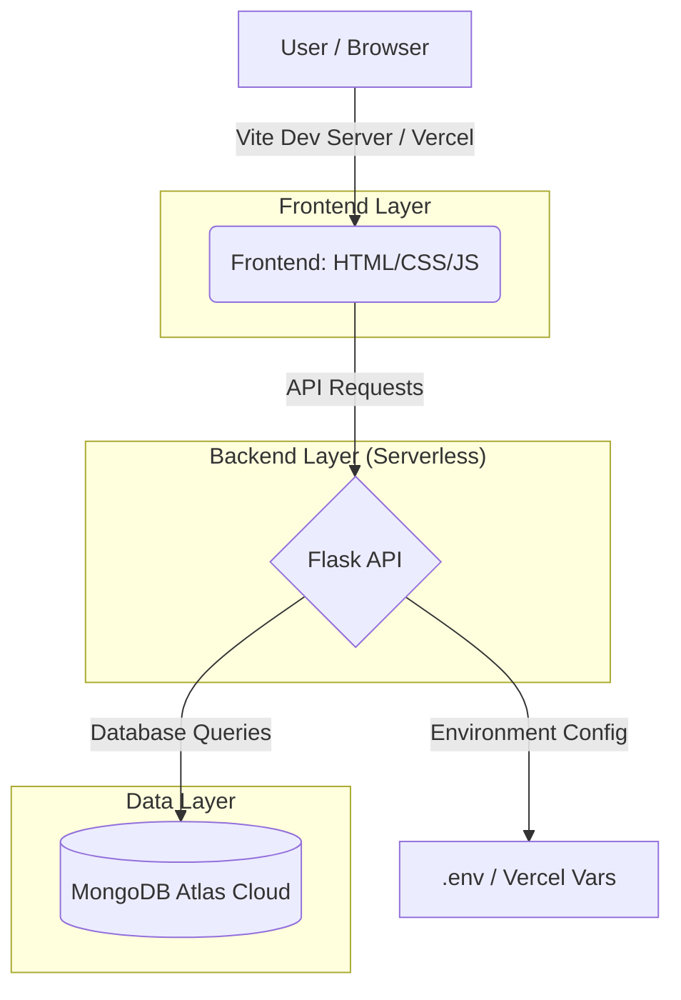

# 🎓 Student Management System

A professional, high-performance Student Management Portal built with a modern tech stack. This system provides students with a real-time dashboard to track their academic progress, attendance, and administrative status.

---

## 🏛️ System Architecture



---

## 📂 Project Structure

```text
student-system/
├── api/                # Backend API (Flask)
│   └── index.py        # Main entry point for Vercel
├── public/             # Static assets
├── src/                # Frontend source files
│   ├── main.js         # Core dashboard logic
│   └── style.css       # Premium glassmorphism UI
├── .env                # Local secrets (ignored by git)
├── index.html          # Main application shell
├── requirements.txt    # Python dependencies
├── vercel.json         # Deployment configuration
└── vite.config.js      # Build tool configuration
```

---

## ✨ Features

### 🏢 Core Functionality
- **Cloud Persistence**: Full CRUD operations using MongoDB Atlas.
- **Secure Auth**: Simple yet effective USN-based authentication.
- **Dynamic Dashboard**: Auto-populates data for Attendance, Subjects, Marks, and Assignments.

### 🎨 Premium UI/UX
- **Glassmorphism Design**: Modern, transparent UI elements with blur effects.
- **Theme Engine**: Toggle between a sleek "Midnight Dark" and "Crystal Light" mode.
- **Responsive Layout**: Sidebar-based navigation that adapts to mobile and tablet screens.
- **Micro-animations**: Smooth transitions and hover effects for a premium feel.

### 🛠️ Technical Highlights
- **Serverless Ready**: Optimized for Vercel's Python runtime.
- **SSL Security**: Integrated `certifi` handling for secure database handshakes.
- **State Management**: Session-based persistence for logged-in users.

---

## 🚀 Setup & Installation

### 1️⃣ Database Setup (MongoDB Atlas)
1.  Create a cluster at [MongoDB Atlas](https://www.mongodb.com/).
2.  Add an IP Access rule (`0.0.0.0/0`) in **Network Access**.
3.  Create a database user and copy the connection string.

### 2️⃣ Local Environment Setup
1.  **Clone & Configure**:
    ```bash
    git clone https://github.com/Nisargadarbari/Student-Management-System.git
    cd Student-Management-System
    ```
2.  **Add Secrets**: Create a `.env` file in the root:
    ```env
    MONGODB_URI=your_connection_string_here
    ```
3.  **Backend Dependencies**:
    ```bash
    pip install -r requirements.txt
    python api/index.py
    ```

### 3️⃣ Frontend Execution
```bash
npm install
npm run dev
```

---

## 🛡️ Environment Variables

| Variable | Description | Source |
| :--- | :--- | :--- |
| `MONGODB_URI` | The connection string for your MongoDB Atlas cluster. | MongoDB Atlas > Connect > Drivers |

---

## 🗺️ Roadmap
- [ ] Password-based authentication (Hashing).
- [ ] Student Profile Photo upload (S3/Cloudinary).
- [ ] PDF Result downloading.
- [ ] Real-time push notifications for assignments.

---

<p align="center">
  Built with ❤️ by <b>Nisarga Darbari</b>
</p>
